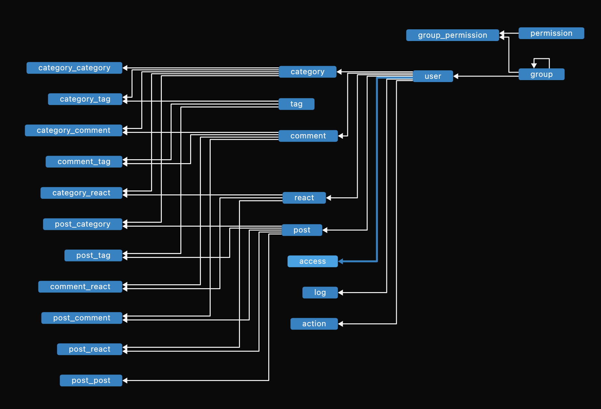

# BlogMaster

BlogMaster is a backend for a blogging platform, built with FastAPI and Tortoise ORM. It includes user authentication, content management, and media uploads, making it suitable for production use.



## Features

- **User Authentication & Authorization**: Role-based access control for secure login.
- **Content Management**: Create, edit, and manage blog posts.
- **Comment System**: Allow users to engage through comments.
- **Media Uploads**: Support for uploading images and other media.
- **SEO & Metadata Management**: Improve visibility with structured metadata.
- **Scalable & Ready for Deployment**: Designed with deployment best practices.

## Installation

### Prerequisites

Ensure you have:

- Python 3.10+
- PostgreSQL or SQLite (for local development)
- Redis (for caching and background tasks)

### Setup

```sh
git clone https://github.com/MohammadrezaAmani/blog-master.git
cd blog-master
python -m venv venv
source venv/bin/activate  # On Windows use `venv\Scripts\activate`
pip install -r requirements.txt
uvicorn app.main:app --host 0.0.0.0 --port 8000 --reload
```

## API Documentation

Access the interactive API docs at:

- [Swagger UI](http://localhost:8000/docs)
- [ReDoc](http://localhost:8000/redoc)

## Contribution

We welcome contributions! To contribute:

1. Fork the repository.
2. Create a new feature branch.
3. Commit your changes.
4. Submit a pull request.

## License

This project is licensed under the MIT License. See the `LICENSE` file for more details.

## Contact

For support or inquiries, please contact **[more.amani@yahoo.com](mailto:more.amani@yahoo.com)** or [open an issue on GitHub](https://github.com/MohammadrezaAmani/blog-master/issues).
